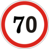
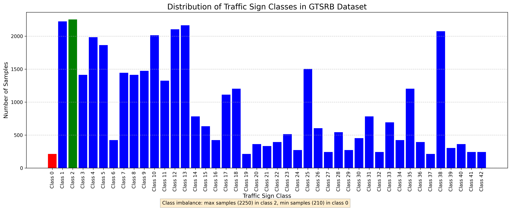
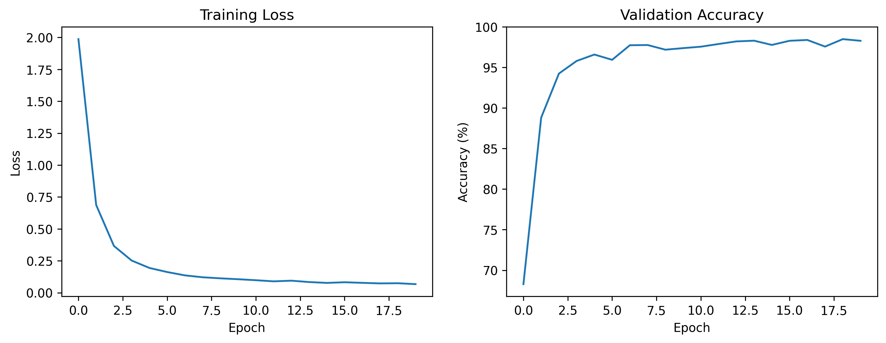
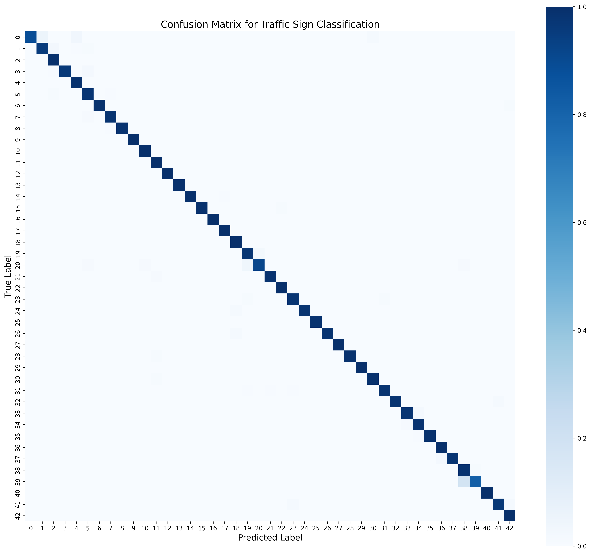
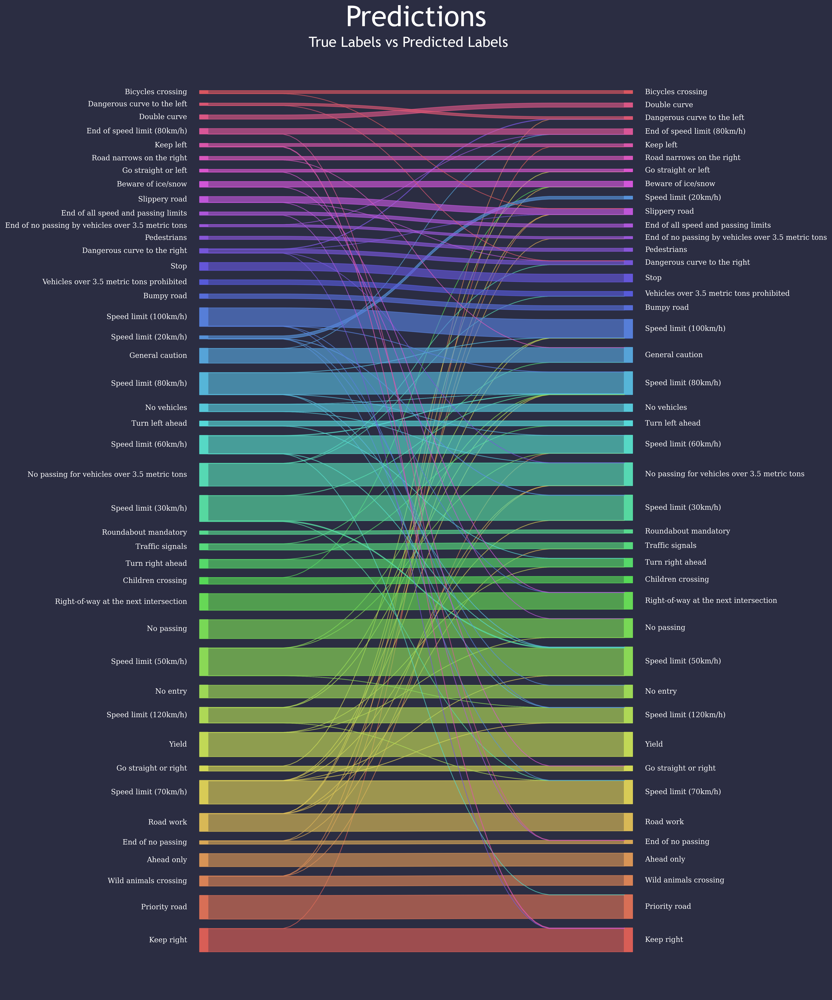
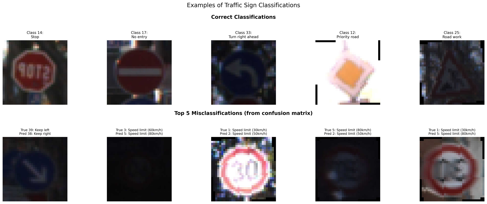

# Traffic Sign Recognition Using Deep Learning Approaches
## German Traffic Sign Recognition Benchmark (GTSRB)

   


## Abstract
This repository contains an implementation of traffic sign recognition systems using the German Traffic Sign Recognition Benchmark (GTSRB) dataset. The project currently focuses on CNN-based classification with plans to extend to more advanced segmentation techniques, showcasing fundamental computer vision concepts and their practical applications in autonomous driving systems. This work was inspired by the [GTSRB Kaggle challenge](https://www.kaggle.com/datasets/meowmeowmeowmeowmeow/gtsrb-german-traffic-sign), which presents a real-world computer vision problem with practical applications in autonomous driving systems.

## Table of Contents
1. [Introduction](#introduction)
2. [Dataset Overview](#dataset-overview)
3. [Baseline Classification Model](#baseline-classification-model)
   - [Model Architecture](#model-architecture)
   - [Training Methodology](#training-methodology)
   - [Results and Evaluation](#results-and-evaluation)
   - [Model Testing Interface](#model-testing-interface)
4. [Future Work: Segmentation Approach](#future-work-segmentation-approach)
5. [Future Work](#future-work)
6. [References](#references)
7. [Acknowledgements](#acknowledgements)

## Introduction
Traffic sign recognition is a critical component in advanced driver assistance systems (ADAS) and autonomous vehicles. This project addresses the challenge of accurately identifying and localizing traffic signs in various conditions. Beyond the practical applications, this work explores classification in deep learning models, with plans to extend to segmentation approaches, demonstrating how increasingly sophisticated techniques can enhance performance on computer vision tasks.

## Dataset Overview
The [German Traffic Sign Recognition Benchmark (GTSRB)](https://benchmark.ini.rub.de/gtsrb_news.html) contains over 50,000 images of 43 different traffic sign classes. This dataset was featured in a popular [Kaggle challenge](https://www.kaggle.com/datasets/meowmeowmeowmeowmeow/gtsrb-german-traffic-sign) and has become a standard benchmark for evaluating traffic sign recognition algorithms. The dataset presents several challenges:
- Variable lighting conditions and weather effects
- Different perspectives and viewing angles
- Varying distances and resolutions
- Partial occlusions and physical damage

### Class Mapping

The GTSRB dataset consists of 43 different traffic sign classes:

| ID | Sign Name | ID | Sign Name | ID | Sign Name |
|----|-----------|-----|-----------|-----|-----------|
| 0 | Speed limit (20km/h) | 15 | No vehicles | 30 | Beware of ice/snow |
| 1 | Speed limit (30km/h) | 16 | Vehicles >3.5t prohibited | 31 | Wild animals crossing |
| 2 | Speed limit (50km/h) | 17 | No entry | 32 | End speed + passing limits |
| 3 | Speed limit (60km/h) | 18 | General caution | 33 | Turn right ahead |
| 4 | Speed limit (70km/h) | 19 | Dangerous curve left | 34 | Turn left ahead |
| 5 | Speed limit (80km/h) | 20 | Dangerous curve right | 35 | Ahead only |
| 6 | End of speed limit (80km/h) | 21 | Double curve | 36 | Go straight or right |
| 7 | Speed limit (100km/h) | 22 | Bumpy road | 37 | Go straight or left |
| 8 | Speed limit (120km/h) | 23 | Slippery road | 38 | Keep right |
| 9 | No passing | 24 | Road narrows on the right | 39 | Keep left |
| 10 | No passing >3.5t vehicles | 25 | Road work | 40 | Roundabout mandatory |
| 11 | Right-of-way at intersection | 26 | Traffic signals | 41 | End of no passing |
| 12 | Priority road | 27 | Pedestrians | 42 | End no passing >3.5t vehicles |
| 13 | Yield | 28 | Children crossing | | |
| 14 | Stop | 29 | Bicycles crossing | | |



*Figure 1: Distribution of classes in the GTSRB dataset.*

## Baseline Classification Model

### Model Architecture
The initial approach implements a Convolutional Neural Network (CNN) for multi-class classification of traffic signs. The architecture consists of:

```python
class TrafficSignCNN(nn.Module):
    def __init__(self, num_classes=43): #GTSRB has 43 classes
        super(TrafficSignCNN, self).__init__()
        self.features = nn.Sequential(
            nn.Conv2d(3, 32, kernel_size=3, padding=1),
            nn.ReLU(),
            nn.MaxPool2d(2, 2),
            nn.Conv2d(32, 64, kernel_size=3, padding=1),
            nn.ReLU(),
            nn.MaxPool2d(2, 2),
            nn.Conv2d(64, 128, kernel_size=3, padding=1),
            nn.ReLU(),
            nn.MaxPool2d(2, 2),
        )
        self.classifier = nn.Sequential(
            nn.Linear(128 * 4 * 4, 512),
            nn.ReLU(),
            nn.Dropout(0.5),
            nn.Linear(512, num_classes)
        )
    
    def forward(self, x):
        x = self.features(x)
        x = x.view(x.size(0), -1)
        x = self.classifier(x)
        return x
```

The model architecture includes three convolutional blocks, each with a ReLU activation function and max pooling layer, followed by a classifier section with dropout for regularization. This design balances complexity with computational efficiency, making it suitable for real-time applications.

*Figure 2: Architecture diagram of the baseline CNN model.*

### Training Methodology
The model was trained with the following hyperparameters:
- Optimizer: Adam
- Learning rate: 0.001
- Batch size: 32
- Number of epochs: 20
- Data augmentation techniques: Random rotation (10°), horizontal flipping, normalization

```python
# Data preprocessing and augmentation
train_transform = transforms.Compose([
    transforms.Resize((32,32)),
    transforms.RandomRotation(10),
    transforms.RandomHorizontalFlip(),
    transforms.ToTensor(),
    transforms.Normalize((0.5, 0.5, 0.5), (0.5, 0.5, 0.5))
])

# Training configuration
criterion = nn.CrossEntropyLoss()
optimizer = optim.Adam(model.parameters(), lr=0.001)
```

The training process included an 80/20 train-validation split to monitor model performance and prevent overfitting.

### Results and Evaluation
The baseline classification model achieved impressive performance metrics:
- Final validation accuracy: 98.29%
- Training loss decreased from 1.9870 to 0.0672 over 20 epochs

Training progression:
```
Epoch 1/20, Loss: 1.9870, Val Accuracy: 68.29%
Epoch 2/20, Loss: 0.6873, Val Accuracy: 88.82%
Epoch 3/20, Loss: 0.3664, Val Accuracy: 94.25%
...
Epoch 18/20, Loss: 0.0729, Val Accuracy: 97.58%
Epoch 19/20, Loss: 0.0742, Val Accuracy: 98.50%
Epoch 20/20, Loss: 0.0672, Val Accuracy: 98.29%
```

The rapid improvement in the early epochs demonstrates the effectiveness of the model architecture and data preprocessing techniques. The final accuracy of 98.29% places this implementation among the top-performing methods for traffic sign classification.



*Figure 3: Training loss and validation accuracy over 20 epochs.*

The learning curves above show a characteristic pattern of rapid initial convergence followed by fine-tuning in later epochs. The validation accuracy stabilizes around 97-98%, indicating good generalization without overfitting.

#### Classification Performance Analysis

To thoroughly analyze the model's classification performance, we visualized the results in two complementary ways:

**Confusion Matrix**

The traditional confusion matrix provides a comprehensive quantitative view of the model's predictions across all 43 traffic sign classes:



*Figure 4: Confusion matrix showing classification results across all 43 classes. The diagonal represents correct classifications, while off-diagonal elements represent misclassifications.*

**Classification Flow Visualization**

To better understand the specific patterns of misclassification, we visualized the flow between true and predicted labels using a Sankey diagram:



*Figure 5: Sankey diagram showing the flow between true labels and predicted labels. This visualization highlights which classes are most commonly confused with each other. Visualization technique adapted from [GTSRB Kaggle discussion](https://www.kaggle.com/datasets/meowmeowmeowmeowmeow/gtsrb-german-traffic-sign/discussion/383646).*

The Sankey diagram reveals that most misclassifications occur between visually similar signs, particularly between different speed limit signs (classes 1-8) and directional instruction signs (classes 38-39).

**Example Classifications**

Below are examples of correctly classified signs and some challenging cases where misclassifications occurred:



*Figure 6: Examples of correctly and incorrectly classified traffic signs.*

### Model Testing Interface
A simple testing interface was implemented to demonstrate the model's practical usability:

```python
def predict_image(image_path, model):
    model.eval()
    image = Image.open(image_path).convert('RGB')
    image = test_transform(image).unsqueeze(0).to(device)
    
    with torch.no_grad():
        outputs = model(image)
        _, predicted = torch.max(outputs, 1)
    
    return predicted.item()
```

This interface allows for easy testing of new traffic sign images and could be extended into a more comprehensive application for real-world use.

## Future Work: Segmentation Approach

### Motivation and Planned Implementation
While the current classification model effectively identifies traffic signs, the next phase of this project will extend to segmentation capabilities. Segmentation will provide several advantages:

1. Precise localization of signs within complex scenes
2. Handling multiple signs in a single image
3. Providing shape information that can serve as an additional verification mechanism

The planned segmentation approach will build upon the classification foundation, adapting the architecture to output pixel-wise predictions rather than class-level predictions. A U-Net inspired architecture is being considered for this extension.

## Future Work
Beyond the planned segmentation implementation, several other promising directions for extending this work include:

1. **Domain Adaptation**: Improving model generalization to different countries' traffic signs and various weather/lighting conditions.

2. **Real-time Implementation**: Optimizing the models for deployment on edge devices in actual vehicles, with a focus on reducing latency while maintaining accuracy.

3. **Temporal Integration**: Incorporating temporal information from video streams to improve recognition in challenging scenarios.

4. **Multi-task Learning**: Extending the model to simultaneously perform classification, detection, and segmentation within a unified architecture.

5. **Integration with 3D Scene Understanding**: Combining traffic sign recognition with depth estimation for better spatial awareness.

## References

## Acknowledgements
This project was developed as part of the GTSRB Kaggle challenge (https://www.kaggle.com/datasets/meowmeowmeowmeowmeow/gtsrb-german-traffic-sign), which provides a comprehensive dataset and platform for developing traffic sign recognition systems.

## License
MIT License

Copyright (c) 2024

Permission is hereby granted, free of charge, to any person obtaining a copy
of this software and associated documentation files (the "Software"), to deal
in the Software without restriction, including without limitation the rights
to use, copy, modify, merge, publish, distribute, sublicense, and/or sell
copies of the Software, and to permit persons to whom the Software is
furnished to do so, subject to the following conditions:

The above copyright notice and this permission notice shall be included in all
copies or substantial portions of the Software.

THE SOFTWARE IS PROVIDED "AS IS", WITHOUT WARRANTY OF ANY KIND, EXPRESS OR
IMPLIED, INCLUDING BUT NOT LIMITED TO THE WARRANTIES OF MERCHANTABILITY,
FITNESS FOR A PARTICULAR PURPOSE AND NONINFRINGEMENT. IN NO EVENT SHALL THE
AUTHORS OR COPYRIGHT HOLDERS BE LIABLE FOR ANY CLAIM, DAMAGES OR OTHER
LIABILITY, WHETHER IN AN ACTION OF CONTRACT, TORT OR OTHERWISE, ARISING FROM,
OUT OF OR IN CONNECTION WITH THE SOFTWARE OR THE USE OR OTHER DEALINGS IN THE
SOFTWARE.
